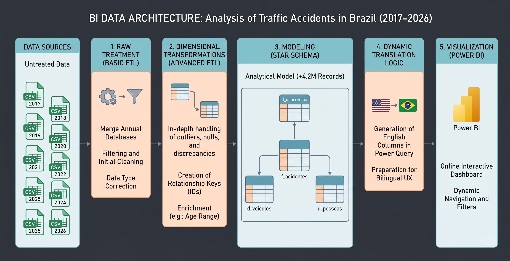
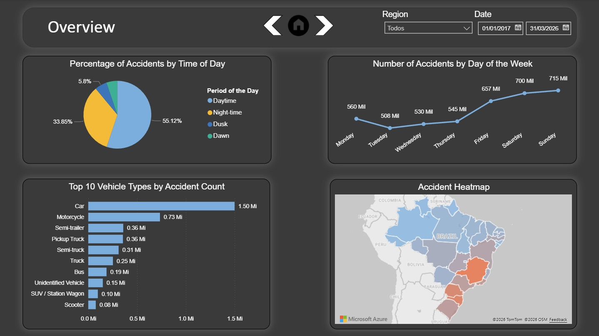
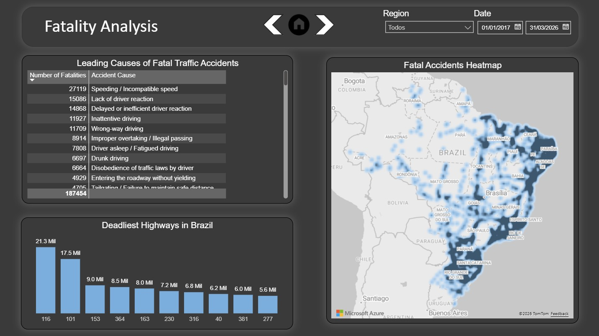
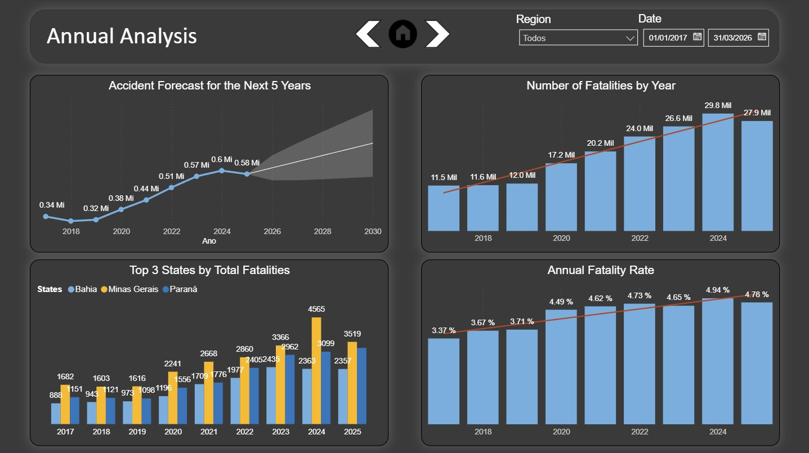
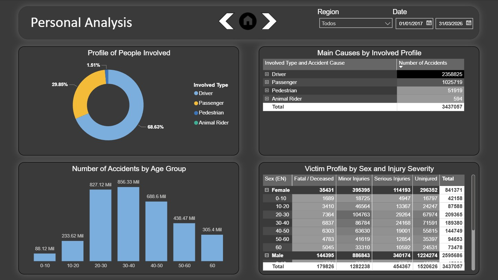

# Traffic Accidents Analysis in Brazil (2017-2025)

### 🎬 Dashboard in Action
  
*
Brief demonstration of the dashboard's interactivity, navigation menu, and dynamic language switching.
*

---

### 📋 Project Summary

This project presents a detailed analysis of traffic accidents recorded by the [Federal Highway Police (PRF)](https://www.gov.br/prf/pt-br/acesso-a-informacao/dados-abertos/dados-abertos-acidentes) between 2017 and 2026. The primary objective was to consolidate, clean, and explore these data to extract real, actionable insights regarding safety on Brazilian highways.

Beyond the social impact, **this dashboard serves as a universal analytical use case**. It demonstrates my capability as a data professional to capture millions of raw records, structure them, and translate them into strategic recommendations. The core premise is clear: the ability to solve problems and optimize processes is independent of the data's origin. The architecture and business logic applied here to traffic accidents could, with the same efficiency, analyze industrial operational incidents, customer churn, or complex financial data.

As major technical highlights, I emphasize the **Star Schema** data modeling—essential to ensure high performance when processing a massive dataset with **over 4.2 million records**—and a 100% bilingual interface (PT/EN). To ensure the report wouldn't lose speed when switching languages, I developed optimized transformation routines (ETL) that translate the database dynamically and seamlessly.

---

### Access and Demonstration
The best way to evaluate this project is by navigating the tool:

* 🌐 **[Access the Interactive Online Dashboard](https://app.powerbi.com/view?r=eyJrIjoiODVkNjZlMzctYjJmMC00NTVkLTk2OGQtMGY0ZDNlOGYzMGQ0IiwidCI6IjlhOWIxZjg2LWJiYWYtNGUzOS1hN2RiLWY1ZmFlOTFlYTkyMiJ9&pageName=3d9bc5c7816faa48f258)**

---

### Questions Answered
The dashboard was built to answer critical business and safety questions, such as:
1. What are the main vehicles, locations, and times of the accidents?
2. Which highways and accident causes present the highest fatality risk?
3. What is the historical trend of accident volumes over the years, and what is the statistical forecast for the future?
4. What is the demographic profile (gender, age) of the victims, and how does it relate to accident severity?

---

### Tools Used
* **Power BI:** Core platform for the entire ETL process, data modeling, and UX/UI.
* **Power Query (M Language):** Used for deep cleaning, error handling, transformation, and consolidation of massive datasets.
* **DAX:** For creating complex measures and calculated columns (e.g., Mortality Rate).
* **Cloudflare (DNS & Email Routing):** For setting up a custom corporate domain, enabling secure public publishing on the Power BI Service.

---

### ETL Process, Architecture, and Data Modeling
The raw data, originating from multiple annual files from the [Federal Highway Police (PRF)](https://www.gov.br/prf/pt-br/acesso-a-informacao/dados-abertos/dados-abertos-acidentes), went through a rigorous data engineering process:

* **Consolidation:** The CSV files from 2017 to 2026 were unified into a single massive database (`f_Acidentes`), serving as the foundation for extracting dimensions and properly structuring the model.
* **Star Schema Modeling:** The final model was designed with one Fact Table (`f_Acidentes`) and three Dimension Tables (`d_Ocorrencia`, `d_Pessoas`, `d_Veiculos`), guaranteeing immediate performance across queries and filters.
* **Cleaning and Transformation:** Handling of null values, conversion errors, outlier removal (e.g., ages > 110 years), and the creation of enrichment columns, such as `Age Group`. *(Note: Ratio calculations, such as the Mortality Rate, were developed using DAX to maintain filter dynamism).*
* **Dictionary via OCR and Optimized Translation:** The 91 distinct accident causes had numerous text variations. To optimize time, I extracted the categories via OCR using the DeepL API via ShareX, performed batch translation using Google Translator, validated it, and implemented this mapping in Power Query. I used an advanced M script with the `Record.FieldOrDefault` function, which automatically scans and translates millions of rows into English without losing performance.
* **UX/UI and Bilingual Mode:** Implementation of fluid, *App-like* navigation using interface buttons to switch between pages, alongside a language control toggle in the menu that changes the dashboard's entire context (PT/EN) in real-time.

---

### Main Dashboards, Insights, and Recommendations

### 1. Overview

* **Insight 1:** Weekends (Saturday and Sunday) concentrate the highest absolute volume of accidents, driven by the increased flow of passenger vehicles and leisure travel.
* **Insight 2:** More than half of the occurrences (55%) happen during the daytime, predominantly involving automobiles. This temporal pattern shows high consistency throughout the analyzed historical series (2017-2026).
* **Strategic Recommendation:** Review the allocation of police personnel and mobile speed cameras. Although it is a cultural norm in Brazil to intensify operations during long holidays, the data shows the need to maintain standardized, preventive policing on **all** regular weekends, mitigating the constant risk of accidents.

---

### 2. Fatality Analysis

* **Insight 1:** "Incompatible Speed" and "Lack of Attention to Driving" emerge as the primary Human Factor causes in fatal accidents.
* **Insight 2:** Highways BR-116 and BR-101 (the country's main logistical corridors) stand out with the highest absolute numbers of fatalities during the analyzed period.
* **Insight 3:** Geographical analysis (Azure Heatmaps) reveals a critically high concentration of lethal occurrences in the metropolitan belts of Curitiba, Belo Horizonte, and Recife.
* **Strategic Recommendation:** Due to the vast territorial extent of BRs 116 and 101 (both over 4,000 km long), ostensive patrolling across the entire network is operationally and financially unfeasible. However, geospatial intelligence cross-references geographic risk (metropolitan areas) with behavioral risk (speeding). The recommendation is the surgical implementation of electronic speed enforcement and physical speed reducers on the approaches to these capitals, combined with geolocated awareness campaigns (via navigation apps) to alert drivers as they enter these critical stretches.

---

### 3. Yearly and Predictive Analysis

* **Insight 1:** The absolute number of accidents shows a strong historical upward trend. Although 2025 data points to a punctual retraction (a drop of approximately 200,000 accidents compared to 2024), the predictive model indicates a resumption of growth in the coming years.
* **Insight 2:** The Mortality Rate follows the upward trend line. This indicates that, in the long term, accidents are not only becoming more frequent but also progressively more lethal.
* **Insight 3:** Minas Gerais emerges as the primary logistical alert state. Starting in 2020, the state experienced an escalation in fatalities, reaching a critical peak in 2024 (an increase of 1,119 deaths compared to 2023). To put this into perspective, the *increase* registered in this year alone surpasses the *total* absolute number of deaths in the state in 2017.
* **Strategic Recommendation:** It is crucial to prevent the punctual drop in 2025 indicators from generating "false optimism" in public administration, given that the statistical model forecasts a continued long-term upward bias. Furthermore, it is highly recommended to create a federal task force focused on the triad of Minas Gerais, Bahia, and Paraná—states that have isolatedly led the fatality rankings since 2017. The objective should be a deep root-cause analysis to understand the anomalies or infrastructure failures causing states with such distinct geographical characteristics to consistently present the country's worst outcomes.

---

### 4. Personal Analysis

* **Insight 1:** The vast majority of victims in traffic incidents (68%) are the drivers themselves, followed by passengers (29%).
* **Insight 2:** Cross-referencing data between the *Involved Profile* and the *Accident Cause* solidifies the premise that the "Human Factor" (specifically direct recklessness, such as lack of attention and speeding) is the central vector of lethality, vastly outweighing weather, mechanical, or road infrastructure factors.
* **Insight 3:** The 20 to 40 age bracket (young and economically active population) represents, by far, the most critical risk group, accumulating over 1.6 million records. In second place is the 40 to 50 age group, with 688,000 records.
* **Strategic Recommendation:** Transition from the current model of generic traffic campaigns to a *Data-Driven Marketing* public communication model. Knowing that drivers between 20 and 40 are the main risk vector, awareness budgets must be hyper-segmented toward this specific target audience. It is recommended to create high-impact campaigns focused on **self-responsibility**, broadcasted primarily on digital channels, social media, and through partnerships with mobility apps. The goal is to expose real statistics directly to the driver, making it clear that their own driving performance is the determining factor between life and death on the highways.

---
### Next Steps (Future Work)
As the data field is constantly evolving, I have mapped some technical improvements that can be implemented in future versions of this project:
* **Machine Learning:** Integration with Python scripts (Scikit-Learn) within Power BI to create a more advanced clustering model for risk areas.
* **Accessibility:** Expand UX/UI options with high-contrast themes for visually impaired users.

### Contact and Connections
Did you enjoy the analysis or have any suggestions for improvement? Feel free to connect with me to talk about data, BI, and technology!

* 💼 **LinkedIn:** [Luis César da Fonseca Pereira](https://www.linkedin.com/in/luis-cesar-pereira/)
* 📧 **E-mail:** [cesar.pereira@lcinsights.com.br](mailto:cesar.pereira@lcinsights.com.br)

⭐️ *If you found this project useful or inspiring, please don't forget to star this repository!*
